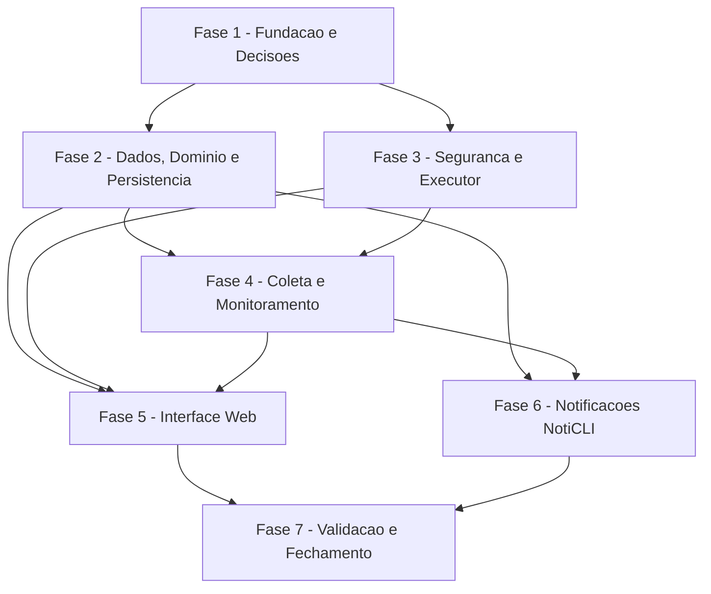

# Tarefas TPanel - MVP

Escopo: Backlog executavel para implementar o MVP do TPanel conforme spec, plano, contratos, modelo de dados, quickstart e checklist de requisitos.

**Legenda de status:**
- `[ ]` Pendente
- `[~]` Em andamento
- `[x]` Concluido
- `[!]` Bloqueado

**Legenda de criticidade:**
- `[C]` Critico - Impacto financeiro direto, regulatorio, seguranca, SLA ou operacao bloqueante
- `[A]` Alto - Funcionalidade essencial
- `[M]` Medio - Necessario, mas sem urgencia imediata

---

## FASE 1 - Fundacao e Decisoes

### 1.1 Resolver decisao de bootstrap PHP e dependencias `[A]`

Ref: checklists/requirements.md CHK018; plan.md Project Structure

- [x] 1.1.1 Avisar o usuario que a decisao humana CHK018 passou a ser necessaria antes de iniciar implementacao de bootstrap
- [x] 1.1.2 Decidir se o MVP usara PHP puro, Composer sem framework ou microframework leve
- [x] 1.1.3 Registrar a decisao em ADR ou atualizar plan.md se a escolha alterar a estrutura
- [x] 1.1.4 Validar que a escolha preserva as camadas UI, Controllers, Services, Command, Monitoring, Repositories e Security

### 1.2 Criar estrutura inicial do repositorio `[A]`

Ref: plan.md Project Structure; constitution.md II

- [x] 1.2.1 Criar diretorios `config/`, `public/`, `src/`, `templates/`, `scripts/`, `database/` e `tests/`
- [x] 1.2.2 Criar entrypoint web inicial em `public/` sem expor segredos ou detalhes de ambiente
- [x] 1.2.3 Criar esqueleto das camadas PHP planejadas em `src/`
- [x] 1.2.4 Validar que a arvore criada bate com `plan.md`

### 1.3 Definir modelos de configuracao e `.gitignore` `[C]`

Ref: spec.md FR-027..FR-028; plan.md Security Plan

- [x] 1.3.1 Criar `.gitignore` cobrindo configuracoes reais, logs, caches, artefatos locais e segredos
- [x] 1.3.2 Criar `config/app.php.model`, `config/database.php.model`, `config/commands.php.model` e `config/noticli.php.model`
- [x] 1.3.3 Documentar valores obrigatorios e opcionais sem incluir credenciais reais
- [x] 1.3.4 Revisar arquivos versionados para confirmar ausencia de segredos

### 1.4 Definir pre-requisitos Debian 13 e permissoes Linux `[C]`

Ref: checklists/requirements.md CHK030; plan.md Technical Context; constitution.md I

- [x] 1.4.1 Listar pacotes minimos: Apache, PHP, extensoes PHP, MySQL client, sudo, systemd tools e utilitarios opcionais
- [x] 1.4.2 Documentar criacao do usuario/grupo `tpanel` e relacao com `www-data`
- [x] 1.4.3 Documentar layout esperado de scripts, ownership e permissoes
- [x] 1.4.4 Validar que pre-requisitos nao concedem permissao ampla ou shell arbitrario

### 1.5 Configurar padroes iniciais de qualidade `[A]`

Ref: constitution.md Quality Gates; plan.md Validation Plan

- [x] 1.5.1 Definir comando local de validacao do projeto conforme stack escolhida
- [x] 1.5.2 Configurar padrao inicial de testes unitarios/integrais para PHP e scripts
- [x] 1.5.3 Criar convencoes de nomenclatura e estilo para camadas PHP e templates
- [x] 1.5.4 Executar validacao inicial e registrar resultado no encerramento da tarefa

---

## FASE 2 - Dados, Dominio e Persistencia

### 2.1 Criar schema inicial MySQL `[C]`

Ref: data-model.md; AGENTS-DATABASE.md; spec.md Key Entities

- [x] 2.1.1 Criar `database/init/01-ddl.sql` com database/schema, charset `utf8mb4` e collation `utf8mb4_unicode_ci`
- [x] 2.1.2 Criar tabelas principais usando nomes em ingles e camelCase conforme regras MySQL locais
- [x] 2.1.3 Definir PKs, FKs, constraints, indices e `ENGINE=InnoDB`
- [x] 2.1.4 Validar script em instancia MySQL limpa

### 2.2 Criar seeds obrigatorios `[A]`

Ref: data-model.md UserRole; spec.md FR-016..FR-017

- [x] 2.2.1 Criar `database/init/02-seed.sql` com papeis `ADMINISTRATOR` e `MONITOR`
- [x] 2.2.2 Inserir capacidades iniciais de cada papel sem conceder acao administrativa ao Monitor
- [x] 2.2.3 Criar dados minimos de configuracao necessarios para inicializacao segura
- [x] 2.2.4 Validar que seeds nao contem credenciais reais

### 2.3 Implementar repositorios de usuarios e papeis `[A]`

Ref: data-model.md AuthenticatedUser/UserRole; contracts/ui-contracts.md

- [x] 2.3.1 Criar camada de acesso a dados para usuario autenticado e papel
- [x] 2.3.2 Implementar mapeamento da identidade Apache para usuario TPanel
- [x] 2.3.3 Implementar validacoes de usuario ativo e papel conhecido
- [x] 2.3.4 Criar testes para mapeamento Administrador, Monitor e usuario desconhecido

### 2.4 Implementar auditoria persistente `[C]`

Ref: spec.md FR-021..FR-022; data-model.md AuditRecord

- [x] 2.4.1 Criar repositorio e servico para gravar audit records imutaveis
- [x] 2.4.2 Garantir campos obrigatorios: ator, acao, timestamp, parametros validados, resultado e motivo de falha
- [x] 2.4.3 Sanitizar campos antes de persistir mensagens, parametros e saidas
- [x] 2.4.4 Criar testes para sucesso, negacao, falha e timeout

### 2.5 Definir coleta historica, freshness e agregacoes `[A]`

Ref: checklists/requirements.md CHK006; spec.md FR-029..FR-030; plan.md Data and Persistence Plan

- [x] 2.5.1 Definir frequencia inicial de coleta historica por categoria de metrica
- [x] 2.5.2 Definir politica de freshness para dados FRESH, STALE e UNKNOWN
- [x] 2.5.3 Definir se o MVP tera agregacoes ou apenas leituras brutas com retencao
- [x] 2.5.4 Atualizar plan.md/data-model.md se a decisao alterar campos ou contratos

### 2.6 Implementar persistencia de metricas e retencao `[A]`

Ref: spec.md FR-029; data-model.md MetricReading

- [x] 2.6.1 Criar repositorio para metricas atuais e historicas
- [x] 2.6.2 Implementar configuracao de retencao com padrao de 90 dias
- [x] 2.6.3 Implementar rotina segura de selecao/purgo de metricas expiradas
- [x] 2.6.4 Criar testes para gravacao, consulta e calculo de expiracao

### 2.7 Quantificar backup e restore `[A]`

Ref: checklists/requirements.md CHK007; spec.md FR-031; plan.md Data and Persistence Plan

- [x] 2.7.1 Definir periodicidade minima recomendada para backup de auditoria e configuracoes
- [x] 2.7.2 Definir politica de backup para metricas historicas sujeitas a retencao
- [x] 2.7.3 Criar procedimento documentado de restore em ambiente de teste
- [x] 2.7.4 Validar procedimento com banco de exemplo sem dados sensiveis

### 2.8 Implementar alertas, reconhecimentos e comentarios `[A]`

Ref: spec.md FR-017; data-model.md Alert/AlertAcknowledgement/EventComment

- [x] 2.8.1 Criar repositorios e servicos para alertas
- [x] 2.8.2 Implementar reconhecimento de alerta por Administrador e Monitor
- [x] 2.8.3 Implementar comentarios em alerta/evento sem alterar estado do servidor
- [x] 2.8.4 Criar testes de permissao, auditoria e sanitizacao de comentarios

---

## FASE 3 - Seguranca e Executor de Comandos

### 3.1 Enumerar catalogo inicial de acoes autorizadas `[C]`

Ref: checklists/requirements.md CHK005; spec.md User Story 3; contracts/command-executor.md

- [x] 3.1.1 Definir lista inicial de acoes administrativas do MVP por area
- [x] 3.1.2 Para cada acao, definir `actionKey`, alvo, parametros permitidos, confirmacao e timeout
- [x] 3.1.3 Excluir explicitamente comandos arbitrarios e acoes fora do MVP
- [x] 3.1.4 Atualizar `config/commands.php.model` com exemplos sem comandos perigosos

### 3.2 Implementar autorizacao por papel e capacidade `[C]`

Ref: spec.md FR-016..FR-018; constitution.md I

- [x] 3.2.1 Criar servico de autorizacao para Administrador e Monitor
- [x] 3.2.2 Bloquear todas as acoes administrativas para Monitor
- [x] 3.2.3 Permitir ao Monitor apenas leitura, reconhecimento de alertas e comentarios
- [x] 3.2.4 Criar testes de negacao, permissao e tentativa de acesso indevido

### 3.3 Implementar validacao de parametros `[C]`

Ref: spec.md FR-019; contracts/command-executor.md

- [x] 3.3.1 Criar validador de parametros baseado no catalogo autorizado
- [x] 3.3.2 Rejeitar parametro ausente, extra, mal formatado ou fora de allowlist
- [x] 3.3.3 Garantir que rejeicao acontece antes de qualquer execucao
- [x] 3.3.4 Criar testes para entradas validas, invalidas e tentativa de injecao

### 3.4 Implementar executor com timeout e saida sanitizada `[C]`

Ref: spec.md FR-020; contracts/command-executor.md

- [x] 3.4.1 Criar executor que aceita apenas `Authorized Command Request`
- [x] 3.4.2 Aplicar timeout por acao conforme catalogo
- [x] 3.4.3 Capturar resultado, exit code e resumo sanitizado de saidas
- [x] 3.4.4 Criar testes/smoke para sucesso, falha e timeout

### 3.5 Implementar idempotencia e protecao contra dupla submissao `[C]`

Ref: checklists/requirements.md CHK026; spec.md FR-032

- [x] 3.5.1 Definir estrategia de `requestId` para acoes confirmadas
- [x] 3.5.2 Impedir reexecucao do mesmo request confirmado dentro da janela definida
- [x] 3.5.3 Retornar resultado anterior ou rejeicao segura para submissao duplicada
- [x] 3.5.4 Criar teste de dupla submissao e retry

### 3.6 Criar scripts do sistema e sudoers restritos `[C]`

Ref: constitution.md I; plan.md Security Plan

- [x] 3.6.1 Criar scripts wrapper em `scripts/system/` para operacoes autorizadas
- [x] 3.6.2 Criar modelo sudoers em `scripts/sudoers/` com escopo minimo
- [x] 3.6.3 Validar ownership esperado para usuario/grupo `tpanel`
- [x] 3.6.4 Criar smoke test/manual check de permissao sem comando arbitrario

---

## FASE 4 - Coleta e Monitoramento

### 4.1 Implementar coletores de sistema, CPU e memoria `[A]`

Ref: spec.md FR-003..FR-005; quickstart.md Scenario 1

- [x] 4.1.1 Implementar servicos de leitura de hostname, Debian, kernel, uptime, data/hora e load average
- [x] 4.1.2 Implementar leitura de CPU total, por nucleo quando disponivel, frequencia e temperatura quando disponivel
- [x] 4.1.3 Implementar leitura de RAM, swap, cache e buffers
- [x] 4.1.4 Criar testes ou fixtures para parsing de saidas comuns

### 4.2 Implementar coletores de armazenamento, SMART, RAID e sensores `[A]`

Ref: spec.md FR-006..FR-008, FR-014; quickstart.md Scenario 2

- [x] 4.2.1 Implementar leitura de filesystems, espaco livre, I/O e inodes
- [x] 4.2.2 Implementar leitura SMART quando disponivel
- [x] 4.2.3 Implementar leitura RAID quando disponivel
- [x] 4.2.4 Tratar ausencia de ferramentas/dispositivos como UNAVAILABLE sem falha fatal

### 4.3 Implementar coletores de rede, processos, logs e seguranca `[A]`

Ref: spec.md FR-009, FR-011..FR-013

- [x] 4.3.1 Implementar leitura de interfaces, IPs, trafego, erros, gateway, DNS e latencia
- [x] 4.3.2 Implementar leitura de processos criticos por CPU e memoria
- [x] 4.3.3 Implementar leitura de journal, syslog e erros recentes com sanitizacao
- [x] 4.3.4 Implementar leitura de SSH, falhas, firewall e atualizacoes disponiveis

### 4.4 Definir permissao de logs para Monitor `[A]`

Ref: checklists/requirements.md CHK013; spec.md FR-012, FR-017

- [x] 4.4.1 Classificar fontes de log em permitidas para Monitor e restritas ao Administrador
- [x] 4.4.2 Definir redacoes obrigatorias para conteudo sensivel
- [x] 4.4.3 Atualizar requisitos/planos se a classificacao alterar escopo
- [x] 4.4.4 Criar testes de acesso para Monitor e Administrador

### 4.5 Implementar monitoramento de servicos, Docker e containers `[A]`

Ref: spec.md FR-010; quickstart.md Scenario 3

- [x] 4.5.1 Implementar listagem de servicos systemd com estado e disponibilidade
- [x] 4.5.2 Implementar listagem Docker/containers quando Docker estiver disponivel
- [x] 4.5.3 Associar acoes permitidas por papel e catalogo autorizado
- [x] 4.5.4 Criar testes/smoke para servidor com e sem Docker

### 4.6 Implementar monitoramento de cron e timers `[A]`

Ref: spec.md FR-015

- [x] 4.6.1 Implementar leitura de cron jobs relevantes
- [x] 4.6.2 Implementar leitura de timers systemd e ultimas/proximas execucoes quando disponiveis
- [x] 4.6.3 Tratar permissoes insuficientes sem quebrar a tela
- [x] 4.6.4 Criar testes/fixtures para saidas comuns de timers

### 4.7 Definir thresholds de severidade `[A]`

Ref: checklists/requirements.md CHK012; spec.md FR-002

- [x] 4.7.1 Definir thresholds iniciais para CPU, memoria, disco, RAID, SMART, rede e servicos
- [x] 4.7.2 Definir regra para UNAVAILABLE versus WARNING/CRITICAL
- [x] 4.7.3 Tornar thresholds configuraveis quando fizer sentido operacional
- [x] 4.7.4 Criar testes para classificacao NORMAL, WARNING, CRITICAL e UNAVAILABLE

---

## FASE 5 - Interface Web e Experiencia

### 5.1 Implementar layout base premium responsivo `[A]`

Ref: spec.md User Story 6; plan.md UI Plan

- [x] 5.1.1 Criar layout base com sidebar recolhivel, topbar, pesquisa, usuario e alertas
- [x] 5.1.2 Implementar tema claro/escuro com contraste adequado
- [x] 5.1.3 Criar componentes base de cards, tabelas, badges de severidade e botoes de acao
- [x] 5.1.4 Validar ausencia de sobreposicao em desktop, tablet e celular

### 5.2 Definir matriz minima de viewports `[A]`

Ref: checklists/requirements.md CHK022; spec.md SC-007

- [x] 5.2.1 Definir viewports minimos de desktop, tablet e mobile para validacao
- [x] 5.2.2 Documentar criterios de sucesso para menu, cards, tabelas e formularios
- [x] 5.2.3 Atualizar quickstart com matriz de viewports
- [x] 5.2.4 Executar validacao manual inicial nos viewports definidos

### 5.3 Implementar dashboard principal `[A]`

Ref: spec.md User Story 1; contracts/ui-contracts.md Dashboard Summary Payload

- [x] 5.3.1 Renderizar cards de status geral, uptime, CPU, memoria, disco, rede, RAID, Docker e alertas
- [x] 5.3.2 Mostrar estados NORMAL, WARNING, CRITICAL e UNAVAILABLE de forma consistente
- [x] 5.3.3 Exibir freshness/collectedAt quando aplicavel
- [x] 5.3.4 Criar teste/validacao de shape do payload do dashboard

### 5.4 Implementar telas detalhadas de monitoramento `[A]`

Ref: spec.md User Story 2; spec.md FR-003..FR-015

- [x] 5.4.1 Criar telas para Sistema, CPU, Memoria, Armazenamento e Discos
- [x] 5.4.2 Criar telas para RAID, Rede, Processos, Logs, Seguranca e Sensores
- [x] 5.4.3 Criar tela de Agendamentos com cron e timers
- [x] 5.4.4 Validar estados indisponiveis sem quebra visual

### 5.5 Implementar telas de servicos e acoes administrativas `[A]`

Ref: spec.md User Story 3 and 5; contracts/ui-contracts.md Administrative Action Form

- [x] 5.5.1 Renderizar servicos/containers com estado e acoes permitidas por papel
- [x] 5.5.2 Criar fluxo de confirmacao para acoes administrativas
- [x] 5.5.3 Mostrar resultados SUCCESS, DENIED, FAILED e TIMED_OUT
- [x] 5.5.4 Validar que Monitor nao ve ou nao consegue disparar controles criticos

### 5.6 Implementar auditoria, alertas e comentarios `[A]`

Ref: spec.md User Story 4; contracts/ui-contracts.md Alert Acknowledgement Form/Event Comment Form

- [x] 5.6.1 Criar tela de auditoria com filtros basicos por resultado, ator e periodo
- [x] 5.6.2 Criar tela/listagem de alertas com reconhecimento
- [x] 5.6.3 Criar fluxo de comentario em alerta/evento para Administrador e Monitor
- [x] 5.6.4 Criar validacao de busca da ultima acao em menos de 60 segundos conforme SC-010

---

## FASE 6 - Notificacoes e Integracao NotiCLI

### 6.1 Preparar modelo de configuracao NotiCLI `[M]`

Ref: spec.md FR-033..FR-034; contracts/notification-events.md

- [x] 6.1.1 Criar `config/noticli.php.model` com caminho do binario, habilitacao e categorias permitidas
- [x] 6.1.2 Documentar que segredos e rotas ficam na configuracao propria do NotiCLI
- [x] 6.1.3 Definir fallback quando NotiCLI estiver desabilitado ou ausente
- [x] 6.1.4 Validar que nenhum token/webhook e solicitado pelo TPanel

### 6.2 Implementar eventos de notificacao `[M]`

Ref: data-model.md NotificationEvent; contracts/notification-events.md

- [x] 6.2.1 Criar servico para preparar sender, category, priority, title e message
- [x] 6.2.2 Aplicar allowlist de categorias e prioridades
- [x] 6.2.3 Persistir NotificationEvent com status PENDING/SKIPPED quando aplicavel
- [x] 6.2.4 Criar testes para payload sem segredos

### 6.3 Invocar NotiCLI e registrar resultado `[M]`

Ref: quickstart.md Scenario 9; contracts/notification-events.md Result Record

- [x] 6.3.1 Invocar `noticli send` somente quando integracao estiver habilitada
- [x] 6.3.2 Capturar exit code e diagnostico sanitizado
- [x] 6.3.3 Atualizar deliveryStatus para SENT, FAILED ou SKIPPED
- [x] 6.3.4 Criar smoke test com comando simulado ou ambiente local controlado

---

## FASE 7 - Validacao, Documentacao e Fechamento

### 7.1 Criar suites de testes de seguranca e dominio `[C]`

Ref: plan.md Validation Plan; constitution.md Quality Gates

- [x] 7.1.1 Cobrir autorizacao por papel e capacidades
- [x] 7.1.2 Cobrir catalogo, validacao de parametros e idempotencia
- [x] 7.1.3 Cobrir auditoria para sucesso, negacao, falha e timeout
- [x] 7.1.4 Executar suite e registrar resultado

### 7.2 Criar testes de persistencia e schema `[A]`

Ref: data-model.md; AGENTS-DATABASE.md

- [x] 7.2.1 Validar criacao do schema em MySQL limpo
- [x] 7.2.2 Validar seeds obrigatorios
- [x] 7.2.3 Validar queries essenciais de auditoria, alertas e metricas
- [x] 7.2.4 Validar politica de retencao de metricas

### 7.3 Executar quickstart completo `[A]`

Ref: quickstart.md

- [x] 7.3.1 Executar cenarios 1 a 4 em ambiente local
- [x] 7.3.2 Executar cenarios 5 a 8 em ambiente local
- [x] 7.3.3 Executar cenario 9 quando NotiCLI estiver configurado ou registrar SKIPPED justificado
- [x] 7.3.4 Executar Roundtrip End-to-End e comparar payloads com contratos

### 7.4 Criar documentacao operacional inicial `[A]`

Ref: spec.md User Story 7; plan.md Security Plan

- [x] 7.4.1 Criar README com objetivo, stack, instalacao local e estrutura do projeto
- [x] 7.4.2 Documentar configuracao Apache, MySQL, usuario `tpanel`, sudoers e arquivos `.model`
- [x] 7.4.3 Documentar como rodar validacoes e quickstart
- [x] 7.4.4 Revisar README para garantir ausencia de segredos reais

### 7.5 Revalidar consistencia SDD `[A]`

Ref: docs/specs/tpanel-mvp/*

- [x] 7.5.1 Executar analise cruzada entre spec, plan, checklist e tasks
- [x] 7.5.2 Atualizar artefatos caso alguma decisao de implementacao altere escopo
- [x] 7.5.3 Confirmar que todos os gaps CHK005, CHK006, CHK007, CHK012, CHK013, CHK022, CHK026, CHK030 e CHK034 foram consumidos
- [x] 7.5.4 Preparar resumo de entrega e status Git para commit

---

## Matriz de Dependencias

## Resumo Quantitativo

| Fase | Tarefas | Subtarefas | Criticidade |
|------|---------|------------|-------------|
| 1 - Fundacao e Decisoes | 5 | 20 | C/A |
| 2 - Dados, Dominio e Persistencia | 8 | 32 | C/A |
| 3 - Seguranca e Executor de Comandos | 6 | 24 | C |
| 4 - Coleta e Monitoramento | 7 | 28 | A |
| 5 - Interface Web e Experiencia | 6 | 24 | A |
| 6 - Notificacoes e Integracao NotiCLI | 3 | 12 | M |
| 7 - Validacao, Documentacao e Fechamento | 5 | 20 | C/A |
| **Total** | **40** | **160** | - |

## Escopo Coberto

| Item | Descricao | Fase |
|------|-----------|------|
| SPEC-US1 | Dashboard geral de saude do servidor | 4, 5 |
| SPEC-US2 | Metricas detalhadas de sistema, hardware, rede, logs, seguranca e agendamentos | 4, 5 |
| SPEC-US3 | Execucao segura de acoes administrativas autorizadas | 3, 5 |
| SPEC-US4 | Auditoria, logs operacionais, alertas e comentarios | 2, 5 |
| SPEC-US5 | Servicos, Docker, containers, cron e timers | 3, 4, 5 |
| SPEC-US6 | UI premium, responsiva e tema claro/escuro | 5 |
| SPEC-US7 | Configuracao segura para GitHub com `.model` | 1, 7 |
| GAP-CHK005 | Enumerar acoes administrativas autorizadas | 3 |
| GAP-CHK006 | Definir coleta historica, freshness e agregacoes | 2 |
| GAP-CHK007 | Quantificar backup/restore | 2 |
| GAP-CHK012 | Definir thresholds de severidade | 4 |
| GAP-CHK013 | Definir logs permitidos para Monitor | 4 |
| GAP-CHK022 | Definir matriz de viewports | 5 |
| GAP-CHK026 | Detalhar idempotencia/double submit | 3 |
| GAP-CHK030 | Definir pacotes/permissoes Debian 13 | 1 |
| GAP-CHK034 | Criar tasks rastreaveis | 7 |

## Escopo Excluido

| Item | Descricao | Motivo |
|------|-----------|--------|
| EX-001 | API REST publica | Fora da fase atual conforme briefing/spec |
| EX-002 | Monitoramento centralizado de multiplos servidores | Pos-MVP |
| EX-003 | Execucao de comandos arbitrarios | Proibido por requisitos e constituicao |
| EX-004 | Provedor proprio de notificacoes dentro do TPanel | NotiCLI e a fonte planejada para notificacoes |
| EX-005 | Dependencia obrigatoria de servicos pagos | Restricao de recursos locais/open source |
